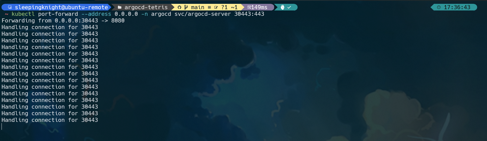
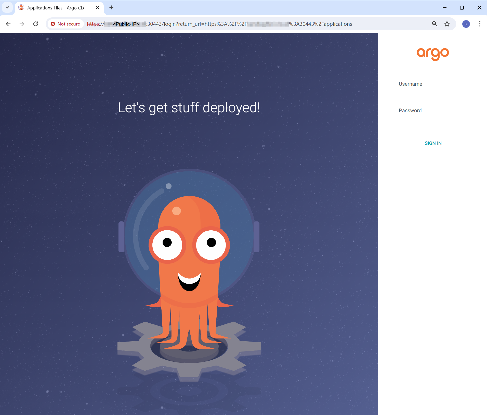

# Part 1: Install ArgoCD

**Step 1:** Create Argo CD namespace by running this command

```shell
kubectl create namespace argocd


# namespace/argocd created
```

**Step 2:** Install Argo CD services and application resources

```shell
kubectl apply -n argocd -f https://raw.githubusercontent.com/argoproj/argo-cd/v2.11.3/manifests/install.yaml


# customresourcedefinition.apiextensions.k8s.io/applications.argoproj.io created
# customresourcedefinition.apiextensions.k8s.io/applicationsets.argoproj.io created
# customresourcedefinition.apiextensions.k8s.io/appprojects.argoproj.io created
# serviceaccount/argocd-application-controller created
# serviceaccount/argocd-applicationset-controller created
# serviceaccount/argocd-dex-server created
# serviceaccount/argocd-notifications-controller created
# serviceaccount/argocd-redis created
# serviceaccount/argocd-repo-server created
# serviceaccount/argocd-server created
# role.rbac.authorization.k8s.io/argocd-application-controller created
# role.rbac.authorization.k8s.io/argocd-applicationset-controller created
# role.rbac.authorization.k8s.io/argocd-dex-server created
# role.rbac.authorization.k8s.io/argocd-notifications-controller created
# role.rbac.authorization.k8s.io/argocd-redis created
# role.rbac.authorization.k8s.io/argocd-server created
# clusterrole.rbac.authorization.k8s.io/argocd-application-controller unchanged
# clusterrole.rbac.authorization.k8s.io/argocd-applicationset-controller unchanged
# clusterrole.rbac.authorization.k8s.io/argocd-server unchanged
# rolebinding.rbac.authorization.k8s.io/argocd-application-controller created
# rolebinding.rbac.authorization.k8s.io/argocd-applicationset-controller created
# rolebinding.rbac.authorization.k8s.io/argocd-dex-server created
# rolebinding.rbac.authorization.k8s.io/argocd-notifications-controller created
# rolebinding.rbac.authorization.k8s.io/argocd-redis created
# rolebinding.rbac.authorization.k8s.io/argocd-server created
# clusterrolebinding.rbac.authorization.k8s.io/argocd-application-controller unchanged
# clusterrolebinding.rbac.authorization.k8s.io/argocd-applicationset-controller unchanged
# clusterrolebinding.rbac.authorization.k8s.io/argocd-server unchanged
# configmap/argocd-cm created
# configmap/argocd-cmd-params-cm created
# configmap/argocd-gpg-keys-cm created
# configmap/argocd-notifications-cm created
# configmap/argocd-rbac-cm created
# configmap/argocd-ssh-known-hosts-cm created
# configmap/argocd-tls-certs-cm created
# secret/argocd-notifications-secret created
# secret/argocd-secret created
# service/argocd-applicationset-controller created
# service/argocd-dex-server created
# service/argocd-metrics created
# service/argocd-notifications-controller-metrics created
# service/argocd-redis created
# service/argocd-repo-server created
# service/argocd-server created
# service/argocd-server-metrics created
# deployment.apps/argocd-applicationset-controller created
# deployment.apps/argocd-dex-server created
# deployment.apps/argocd-notifications-controller created
# deployment.apps/argocd-redis created
# deployment.apps/argocd-repo-server created
# deployment.apps/argocd-server created
# statefulset.apps/argocd-application-controller created
# networkpolicy.networking.k8s.io/argocd-application-controller-network-policy created
# networkpolicy.networking.k8s.io/argocd-applicationset-controller-network-policy created
# networkpolicy.networking.k8s.io/argocd-dex-server-network-policy created
# networkpolicy.networking.k8s.io/argocd-notifications-controller-network-policy created
# networkpolicy.networking.k8s.io/argocd-redis-network-policy created
# networkpolicy.networking.k8s.io/argocd-repo-server-network-policy created
# networkpolicy.networking.k8s.io/argocd-server-network-policy created
```

**Step 3:** You can verify Argo CD resources that been deployed, by running this command

```shell
kubectl get all -n argocd


# NAME                                                    READY   STATUS    RESTARTS   AGE
# pod/argocd-application-controller-0                     1/1     Running   0          60s
# pod/argocd-applicationset-controller-8485455fd5-f5w76   1/1     Running   0          61s
# pod/argocd-dex-server-66779d96df-2gsvd                  1/1     Running   0          61s
# pod/argocd-notifications-controller-c4b69fb67-l4c84     1/1     Running   0          61s
# pod/argocd-redis-7bf7cb9748-247sj                       1/1     Running   0          60s
# pod/argocd-repo-server-795d79dfb6-8pqcm                 1/1     Running   0          60s
# pod/argocd-server-544b7f897d-vf4cl                      1/1     Running   0          60s

# NAME                                              TYPE        CLUSTER-IP      EXTERNAL-IP   PORT(S)                      AGE
# service/argocd-applicationset-controller          ClusterIP   10.96.143.186   <none>        7000/TCP,8080/TCP            61s
# service/argocd-dex-server                         ClusterIP   10.96.150.132   <none>        5556/TCP,5557/TCP,5558/TCP   61s
# service/argocd-metrics                            ClusterIP   10.96.89.241    <none>        8082/TCP                     61s
# service/argocd-notifications-controller-metrics   ClusterIP   10.96.189.105   <none>        9001/TCP                     61s
# service/argocd-redis                              ClusterIP   10.96.56.224    <none>        6379/TCP                     61s
# service/argocd-repo-server                        ClusterIP   10.96.63.42     <none>        8081/TCP,8084/TCP            61s
# service/argocd-server                             ClusterIP   10.96.153.118   <none>        80/TCP,443/TCP               61s
# service/argocd-server-metrics                     ClusterIP   10.96.99.132    <none>        8083/TCP                     61s

# NAME                                               READY   UP-TO-DATE   AVAILABLE   AGE
# deployment.apps/argocd-applicationset-controller   1/1     1            1           61s
# deployment.apps/argocd-dex-server                  1/1     1            1           61s
# deployment.apps/argocd-notifications-controller    1/1     1            1           61s
# deployment.apps/argocd-redis                       1/1     1            1           61s
# deployment.apps/argocd-repo-server                 1/1     1            1           60s
# deployment.apps/argocd-server                      1/1     1            1           60s

# NAME                                                          DESIRED   CURRENT   READY   AGE
# replicaset.apps/argocd-applicationset-controller-8485455fd5   1         1         1       61s
# replicaset.apps/argocd-dex-server-66779d96df                  1         1         1       61s
# replicaset.apps/argocd-notifications-controller-c4b69fb67     1         1         1       61s
# replicaset.apps/argocd-redis-7bf7cb9748                       1         1         1       61s
# replicaset.apps/argocd-repo-server-795d79dfb6                 1         1         1       60s
# replicaset.apps/argocd-server-544b7f897d                      1         1         1       60s

# NAME                                             READY   AGE
# statefulset.apps/argocd-application-controller   1/1     60s
```


# Part 2: Download Argo CD CLI

**Step 1:** Download the latest Argo CD version from this [repo](https://github.com/argoproj/argo-cd/releases/latest). More detailed installation instructions can be found via the [CLI installation documentation](https://argo-cd.readthedocs.io/en/stable/cli_installation/).

```shell
sudo curl -sSL -o /usr/local/bin/argocd https://github.com/argoproj/argo-cd/releases/download/v2.11.3/argocd-linux-amd64
sudo chmod +x /usr/local/bin/argocd
```

**Step 2:** You can also verify the installation version by running this command

```shell
argocd version --client


# argocd: v2.11.3+3f344d5
#   BuildDate: 2024-06-06T09:27:36Z
#   GitCommit: 3f344d54a4e0bbbb4313e1c19cfe1e544b162598
#   GitTreeState: clean
#   GoVersion: go1.21.10
#   Compiler: gc
#   Platform: linux/amd64
```


# Part 3: Access The Argo CD API Server
By default, the Argo CD API server is not exposed with an external IP. To access the API server, you choose one of techniques to expose the Argo CD API server, such as **Service Type Load Balancer**, **Ingress** or **Port Forwarding**.

In this demo, I will use port forwarding method to access ArgoCD server

**Step 1:** Please, run this command to connect to the API server without exposing the service.

```shell
kubectl port-forward --address 0.0.0.0 -n argocd svc/argocd-server 30443:443
```



**Step 2:** The API server can then be accessed using https://{{Public-IP}}:30443

**Step 3:** If you got the warning message **Your connection is not private**, please ignore it, and click **Advanced --> Proccess to {{Public-IP}}**. After that, you will be redirected to the ArgoCD server login page.




