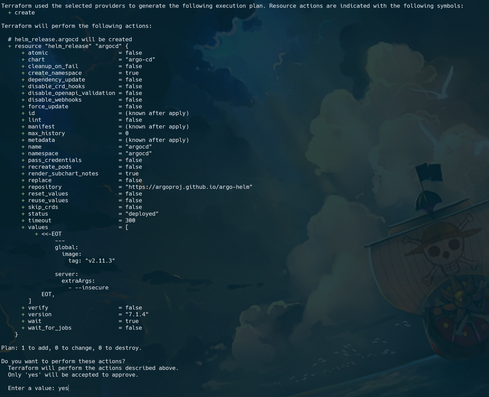
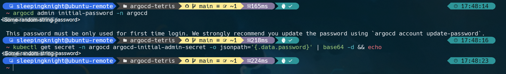
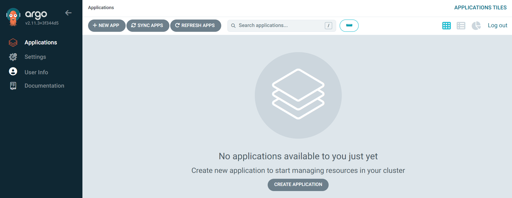

# Part 1a: Install ArgoCD (Vanilla)

**Step 1:** Create Argo CD namespace by running this command

```shell
kubectl create namespace argocd


# namespace/argocd created
```

**Step 2:** Install Argo CD services and application resources

```shell
kubectl apply -n argocd -f https://raw.githubusercontent.com/argoproj/argo-cd/v2.11.3/manifests/install.yaml


# customresourcedefinition.apiextensions.k8s.io/applications.argoproj.io created
# customresourcedefinition.apiextensions.k8s.io/applicationsets.argoproj.io created
# customresourcedefinition.apiextensions.k8s.io/appprojects.argoproj.io created
# serviceaccount/argocd-application-controller created
# serviceaccount/argocd-applicationset-controller created
# serviceaccount/argocd-dex-server created
# serviceaccount/argocd-notifications-controller created
# serviceaccount/argocd-redis created
# serviceaccount/argocd-repo-server created
# serviceaccount/argocd-server created
# role.rbac.authorization.k8s.io/argocd-application-controller created
# role.rbac.authorization.k8s.io/argocd-applicationset-controller created
# role.rbac.authorization.k8s.io/argocd-dex-server created
# role.rbac.authorization.k8s.io/argocd-notifications-controller created
# role.rbac.authorization.k8s.io/argocd-redis created
# role.rbac.authorization.k8s.io/argocd-server created
# clusterrole.rbac.authorization.k8s.io/argocd-application-controller unchanged
# clusterrole.rbac.authorization.k8s.io/argocd-applicationset-controller unchanged
# clusterrole.rbac.authorization.k8s.io/argocd-server unchanged
# rolebinding.rbac.authorization.k8s.io/argocd-application-controller created
# rolebinding.rbac.authorization.k8s.io/argocd-applicationset-controller created
# rolebinding.rbac.authorization.k8s.io/argocd-dex-server created
# rolebinding.rbac.authorization.k8s.io/argocd-notifications-controller created
# rolebinding.rbac.authorization.k8s.io/argocd-redis created
# rolebinding.rbac.authorization.k8s.io/argocd-server created
# clusterrolebinding.rbac.authorization.k8s.io/argocd-application-controller unchanged
# clusterrolebinding.rbac.authorization.k8s.io/argocd-applicationset-controller unchanged
# clusterrolebinding.rbac.authorization.k8s.io/argocd-server unchanged
# configmap/argocd-cm created
# configmap/argocd-cmd-params-cm created
# configmap/argocd-gpg-keys-cm created
# configmap/argocd-notifications-cm created
# configmap/argocd-rbac-cm created
# configmap/argocd-ssh-known-hosts-cm created
# configmap/argocd-tls-certs-cm created
# secret/argocd-notifications-secret created
# secret/argocd-secret created
# service/argocd-applicationset-controller created
# service/argocd-dex-server created
# service/argocd-metrics created
# service/argocd-notifications-controller-metrics created
# service/argocd-redis created
# service/argocd-repo-server created
# service/argocd-server created
# service/argocd-server-metrics created
# deployment.apps/argocd-applicationset-controller created
# deployment.apps/argocd-dex-server created
# deployment.apps/argocd-notifications-controller created
# deployment.apps/argocd-redis created
# deployment.apps/argocd-repo-server created
# deployment.apps/argocd-server created
# statefulset.apps/argocd-application-controller created
# networkpolicy.networking.k8s.io/argocd-application-controller-network-policy created
# networkpolicy.networking.k8s.io/argocd-applicationset-controller-network-policy created
# networkpolicy.networking.k8s.io/argocd-dex-server-network-policy created
# networkpolicy.networking.k8s.io/argocd-notifications-controller-network-policy created
# networkpolicy.networking.k8s.io/argocd-redis-network-policy created
# networkpolicy.networking.k8s.io/argocd-repo-server-network-policy created
# networkpolicy.networking.k8s.io/argocd-server-network-policy created
```

**Step 3:** You can verify Argo CD resources that been deployed, by running this command

```shell
kubectl get all -n argocd


# NAME                                                    READY   STATUS    RESTARTS   AGE
# pod/argocd-application-controller-0                     1/1     Running   0          60s
# pod/argocd-applicationset-controller-8485455fd5-f5w76   1/1     Running   0          61s
# pod/argocd-dex-server-66779d96df-2gsvd                  1/1     Running   0          61s
# pod/argocd-notifications-controller-c4b69fb67-l4c84     1/1     Running   0          61s
# pod/argocd-redis-7bf7cb9748-247sj                       1/1     Running   0          60s
# pod/argocd-repo-server-795d79dfb6-8pqcm                 1/1     Running   0          60s
# pod/argocd-server-544b7f897d-vf4cl                      1/1     Running   0          60s

# NAME                                              TYPE        CLUSTER-IP      EXTERNAL-IP   PORT(S)                      AGE
# service/argocd-applicationset-controller          ClusterIP   10.96.143.186   <none>        7000/TCP,8080/TCP            61s
# service/argocd-dex-server                         ClusterIP   10.96.150.132   <none>        5556/TCP,5557/TCP,5558/TCP   61s
# service/argocd-metrics                            ClusterIP   10.96.89.241    <none>        8082/TCP                     61s
# service/argocd-notifications-controller-metrics   ClusterIP   10.96.189.105   <none>        9001/TCP                     61s
# service/argocd-redis                              ClusterIP   10.96.56.224    <none>        6379/TCP                     61s
# service/argocd-repo-server                        ClusterIP   10.96.63.42     <none>        8081/TCP,8084/TCP            61s
# service/argocd-server                             ClusterIP   10.96.153.118   <none>        80/TCP,443/TCP               61s
# service/argocd-server-metrics                     ClusterIP   10.96.99.132    <none>        8083/TCP                     61s

# NAME                                               READY   UP-TO-DATE   AVAILABLE   AGE
# deployment.apps/argocd-applicationset-controller   1/1     1            1           61s
# deployment.apps/argocd-dex-server                  1/1     1            1           61s
# deployment.apps/argocd-notifications-controller    1/1     1            1           61s
# deployment.apps/argocd-redis                       1/1     1            1           61s
# deployment.apps/argocd-repo-server                 1/1     1            1           60s
# deployment.apps/argocd-server                      1/1     1            1           60s

# NAME                                                          DESIRED   CURRENT   READY   AGE
# replicaset.apps/argocd-applicationset-controller-8485455fd5   1         1         1       61s
# replicaset.apps/argocd-dex-server-66779d96df                  1         1         1       61s
# replicaset.apps/argocd-notifications-controller-c4b69fb67     1         1         1       61s
# replicaset.apps/argocd-redis-7bf7cb9748                       1         1         1       61s
# replicaset.apps/argocd-repo-server-795d79dfb6                 1         1         1       60s
# replicaset.apps/argocd-server-544b7f897d                      1         1         1       60s

# NAME                                             READY   AGE
# statefulset.apps/argocd-application-controller   1/1     60s
```

# Part 1b: Install ArgoCD (Helm Repo)

**Step 1:** Add ArgoCD Helm repository
```shell
helm repo add argocd https://argoproj.github.io/argo-helm


# "argocd" has been added to your repositories
```

**Step 2:** You can search available Chart on the ArgoCD Repo by running this command
```shell
helm repo update


# Hang tight while we grab the latest from your chart repositories...
# ...Successfully got an update from the "argocd" chart repository
# Update Complete. ⎈Happy Helming!⎈
```

```shell
helm search repo argocd


# NAME                            CHART VERSION   APP VERSION     DESCRIPTION
# argocd/argocd-applicationset    1.12.1          v0.4.1          A Helm chart for installing ArgoCD ApplicationSet
# argocd/argocd-apps              2.0.0                           A Helm chart for managing additional Argo CD Ap...
# argocd/argocd-image-updater     0.10.2          v0.13.1         A Helm chart for Argo CD Image Updater, a tool ...
# argocd/argocd-notifications     1.8.1           v1.2.1          A Helm chart for ArgoCD notifications, an add-o...
# argocd/argo                     1.0.0           v2.12.5         A Helm chart for Argo Workflows
# argocd/argo-cd                  7.1.4           v2.11.3         A Helm chart for Argo CD, a declarative, GitOps...
# argocd/argo-ci                  1.0.0           v1.0.0-alpha2   A Helm chart for Argo-CI
# argocd/argo-events              2.4.6           v1.9.2          A Helm chart for Argo Events, the event-driven ...
# argocd/argo-lite                0.1.0                           Lighweight workflow engine for Kubernetes
# argocd/argo-rollouts            2.36.0          v1.7.0          A Helm chart for Argo Rollouts
# argocd/argo-workflows           0.41.11         v3.5.8          A Helm chart for Argo Workflows
```

**Step 3:** Deploy Argo CD components Helm Chart using Terraform
```shell
make tfi && make tfa
```
You will be prompted to perform action, just input the value **yes** and hit Enter



**Step 4 [Optional]:** Import existing terraform resources, and re-apply it if necessary
```shell
helm ls -A


# NAME    NAMESPACE       REVISION        UPDATED                                 STATUS          CHART           APP VERSION
# argocd  argocd          1               2024-06-19 17:53:49.957581613 +0700 WIB deployed        argo-cd-7.1.4   v2.11.3
```

```shell
terraform import helm_release.argocd argocd/argocd


# helm_release.argocd: Importing from ID "argocd/argocd"...
# helm_release.argocd: Import prepared!
#   Prepared helm_release for import
# helm_release.argocd: Refreshing state... [id=argocd]

# Import successful!

# The resources that were imported are shown above. These resources are now in
# your Terraform state and will henceforth be managed by Terraform.
```


# Part 2: Download Argo CD CLI

**Step 1:** Download the latest Argo CD version from this [repo](https://github.com/argoproj/argo-cd/releases/latest). More detailed installation instructions can be found via the [CLI installation documentation](https://argo-cd.readthedocs.io/en/stable/cli_installation/).

```shell
sudo curl -sSL -o /usr/local/bin/argocd https://github.com/argoproj/argo-cd/releases/download/v2.11.3/argocd-linux-amd64
sudo chmod +x /usr/local/bin/argocd
```

**Step 2:** You can also verify the installation version by running this command

```shell
argocd version --client


# argocd: v2.11.3+3f344d5
#   BuildDate: 2024-06-06T09:27:36Z
#   GitCommit: 3f344d54a4e0bbbb4313e1c19cfe1e544b162598
#   GitTreeState: clean
#   GoVersion: go1.21.10
#   Compiler: gc
#   Platform: linux/amd64
```


# Part 3: Access The Argo CD API Server
By default, the Argo CD API server is not exposed with an external IP. To access the API server, you choose one of techniques to expose the Argo CD API server, such as **Service Type Load Balancer**, **Ingress** or **Port Forwarding**.

In this demo, I will use port forwarding method to access ArgoCD server

**Step 1:** Please, run this command to connect to the API server without exposing the service.

```shell
kubectl port-forward --address 0.0.0.0 -n argocd svc/argocd-server 30443:443
```


**Step 2:** The API server can then be accessed using https://{{Public-IP}}:30443

**Step 3:** If you got the warning message **Your connection is not private**, please ignore it, and click **Advanced --> Proccess to {{Public-IP}}**. After that, you will be redirected to the ArgoCD server login page.


# Part 4: Login to Argo CD Server

**Step 1:** The initial password for the **admin** user account is auto-generated and stored as clear text in the field password in a secret named argocd-initial-admin-secret in your Argo CD installation namespace. You can simply retrieve this password using the argocd CLI:

```shell
argocd admin initial-password -n argocd
```

**Step 2:** You can also retrieved initial password in the argocd secret, by running this command

```shell
kubectl get secret -n argocd argocd-initial-admin-secret -o jsonpath='{.data.password}' | base64 -d
```



**Step 3:** If you would like to reset password, you can run these commands

```shell
argocd login --port-forward --port-forward-namespace argocd --plaintext localhost:30443


# Username: admin
# Password:
# 'admin:login' logged in successfully
# Context 'port-forward' updated
```

```shell
argocd account update-password --account admin --new-password <your-new-password> --server localhost:30443


# *** Enter password of currently logged in user (admin):
# Password updated
# Context 'port-forward' updated
```

```shell
argocd logout port-forward


# Logged out from 'port-forward'
```

**Step 4:** Input username and password for admin user, and hit Enter to sign in via Argo CD server on browser


