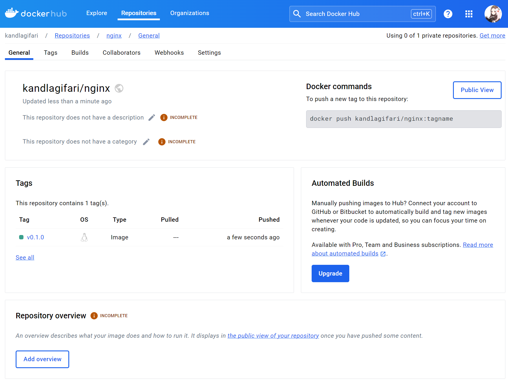
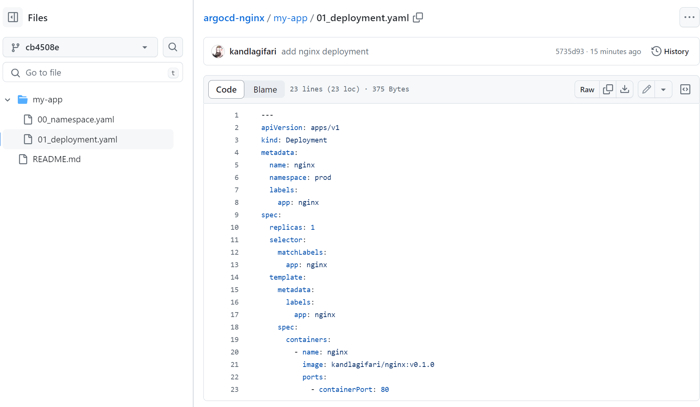
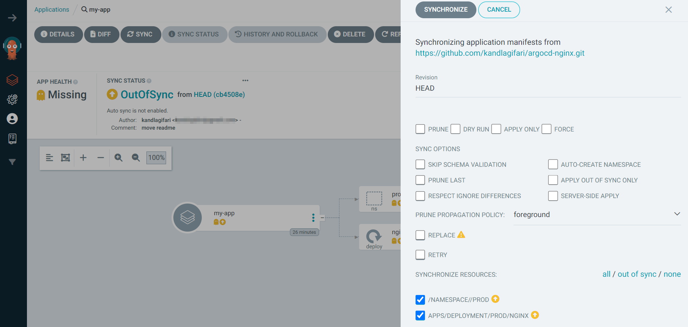
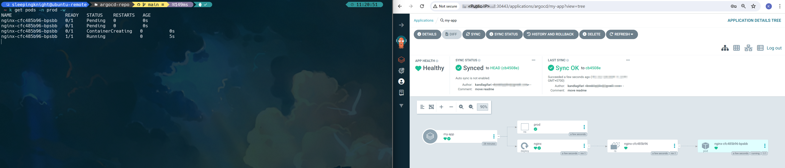
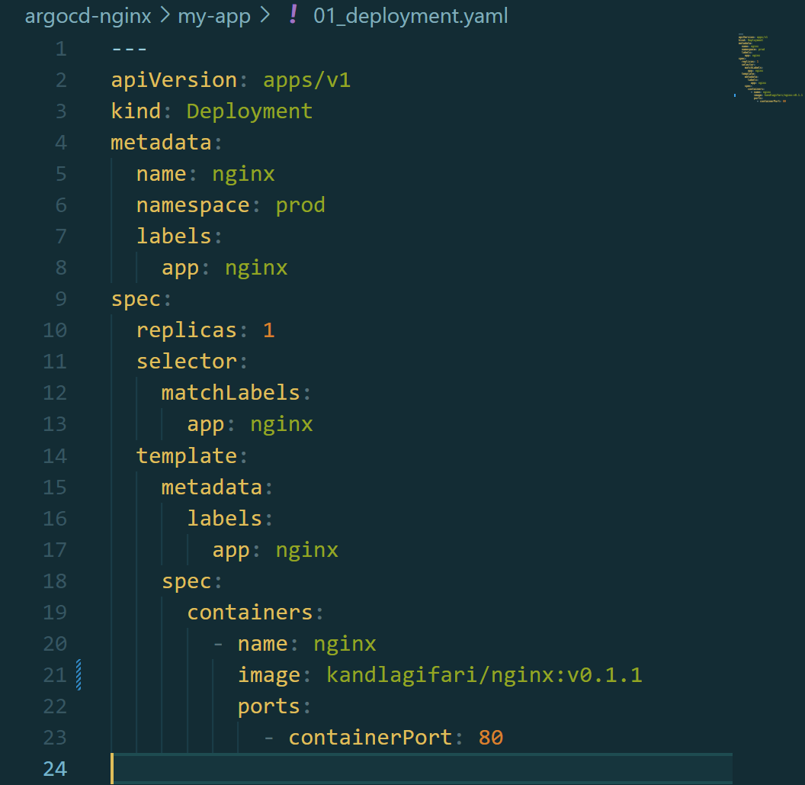
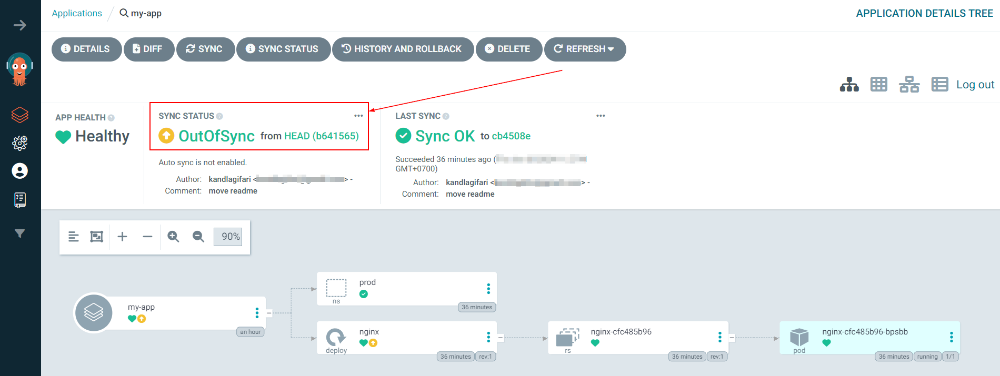
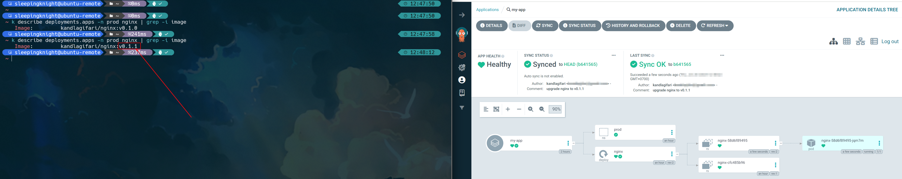
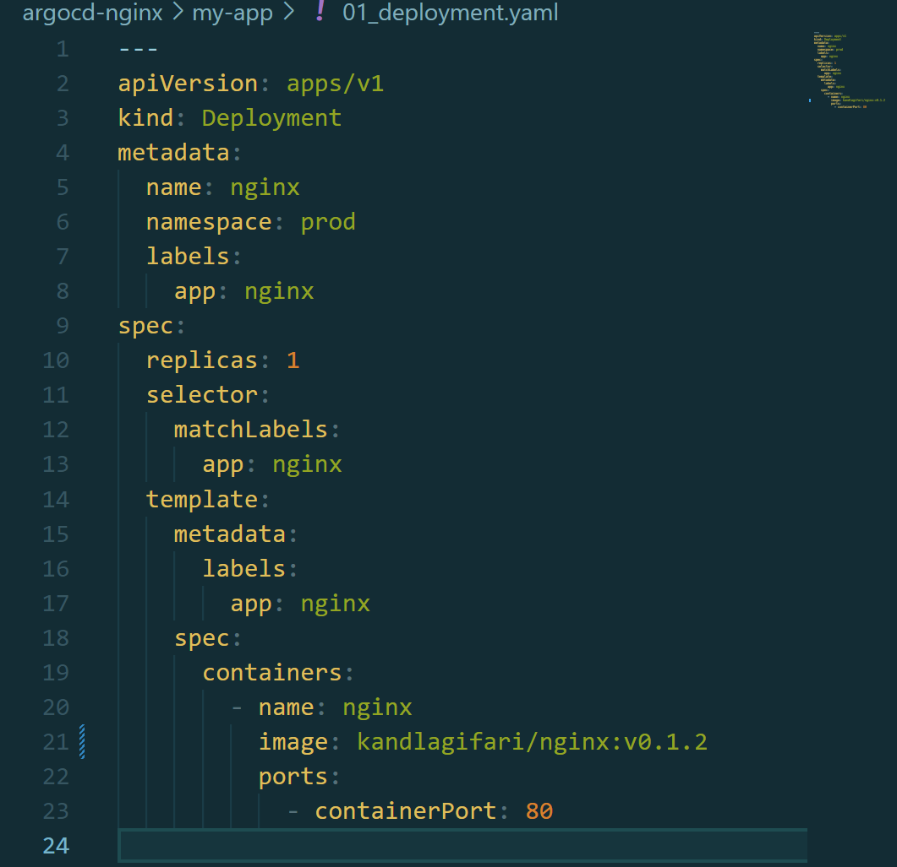

# Part 1: Pull and Push Nginx Image

**Step 1:** We need to pull nginx image to play with

```shell
docker pull nginx:1.27.0


# 1.27.0: Pulling from library/nginx
# 2cc3ae149d28: Pull complete
# a97f9034bc9b: Pull complete
# 9571e65a55a3: Pull complete
# 0b432cb2d95e: Pull complete
# 24436676f2de: Pull complete
# 928cc9acedf0: Pull complete
# ca6fb48c6db4: Pull complete
# Digest: sha256:56b388b0d79c738f4cf51bbaf184a14fab19337f4819ceb2cae7d94100262de8
# Status: Downloaded newer image for nginx:1.27.0
# docker.io/library/nginx:1.27.0
```

**Step 2:** List the images that we already pulled

```shell
docker images


# REPOSITORY            TAG         IMAGE ID       CREATED        SIZE
# nginx                 1.27.0      dde0cca083bc   3 weeks ago    188MB
```

**Step 3:** Rename the images tag, so that we can push to our Docker Hub account (we don't need create repo on the Docker Hub for Public images)

```shell
docker tag nginx:1.27.0 kandlagifari/nginx:v0.1.0
```

**Step 4:** We need to login first, before we can push the images into Docker Hub

```shell
docker login -u kandlagifari
```

**Step 5:** After that, we can push the images into Docker Hub
```shell
docker push kandlagifari/nginx:v0.1.0


# The push refers to repository [docker.io/kandlagifari/nginx]
# 10655d686986: Mounted from library/nginx
# 3dd5fd695861: Mounted from library/nginx
# eddb6eb0845b: Mounted from library/nginx
# 8162731f1e8d: Mounted from library/nginx
# cddaf363c4d4: Mounted from library/nginx
# 409a3bc90254: Mounted from library/nginx
# 1387079e86ad: Mounted from library/nginx
# v0.1.0: digest: sha256:80550935209dd7f6b2d7e8401b9365837e3edd4b047f5a1a7d393e9f04d34498 size: 1778
```

**Step 6:** We can also check on our Docker Hub repository




# Part 2: Deploy First Argo CD Application

**Step 1**: Create GitHub Public Repository to store our nginx kubernetes manifests (you can also refer on the **argocd-nginx** directory)



**Step 2:** Create bare minimum **application.yaml** file

```yaml
---
apiVersion: argoproj.io/v1alpha1
kind: Application
metadata:
  name: my-app
  namespace: argocd
spec:
  project: default
  source:
    repoURL: https://github.com/kandlagifari/argocd-nginx.git
    targetRevision: HEAD
    path: my-app
  destination:
    server: https://kubernetes.default.svc
```

**Step 3:** Apply **application.yaml** file to deploy nginx application
```shell
kubectl apply -f application.yaml


# application.argoproj.io/my-app created
```

**Step 4:** By default, Argo CD will automatically refresh and compare the state of **kubernetes** and **git**, but it would not apply it. This is the default strategy, and can be useful in Production environment, if you want very careful. However, we can also configure the git state and kubernetes state.



To actually deploy that, we need to click on **Sync -> Synchronize** (just keep the default value)




# Part 3: Update Nginx Image

**Step 1:** Update the image tag

```shell
docker tag nginx:1.27.0 kandlagifari/nginx:v0.1.1
```

**Step 2:** Push the updated image to Docker Hub

```shell
docker push kandlagifari/nginx:v0.1.1


# The push refers to repository [docker.io/kandlagifari/nginx]
# 10655d686986: Layer already exists
# 3dd5fd695861: Layer already exists
# eddb6eb0845b: Layer already exists
# 8162731f1e8d: Layer already exists
# cddaf363c4d4: Layer already exists
# 409a3bc90254: Layer already exists
# 1387079e86ad: Layer already exists
# v0.1.1: digest: sha256:80550935209dd7f6b2d7e8401b9365837e3edd4b047f5a1a7d393e9f04d34498 size: 1778
```

**Step 3:** Update the image tag on the deployment manifest on the **argocd-nginx** repository to use **kandlagifari/nginx:v0.1.1** image



**Step 4:** Commit and push the changes

```shell
git add . && git commit -m "upgrade nginx to v0.1.1" && git push origin main
```

**Step 5:** On the Argo CD **my-app** application, click on the **Refresh** button to get latest commit on the GitHub **argocd-nginx** repository

**Step 6:** You will notice that, the Sync Status will be changes to **OutOfSync**



Try to actually deploy it by clicking on **Sync -> Synchronize** (just keep the default value). Wait few minutes, and you will see that our application has been deployed with new image tag




# Part 4: Automatically Sync Updated Image

**Step 1:** Update the image tag

```shell
docker tag nginx:1.27.0 kandlagifari/nginx:v0.1.2
```

**Step 2:** Push the updated image to Docker Hub

```shell
docker push kandlagifari/nginx:v0.1.2


# The push refers to repository [docker.io/kandlagifari/nginx]
# 10655d686986: Layer already exists
# 3dd5fd695861: Layer already exists
# eddb6eb0845b: Layer already exists
# 8162731f1e8d: Layer already exists
# cddaf363c4d4: Layer already exists
# 409a3bc90254: Layer already exists
# 1387079e86ad: Layer already exists
# v0.1.2: digest: sha256:80550935209dd7f6b2d7e8401b9365837e3edd4b047f5a1a7d393e9f04d34498 size: 1778
```

**Step 3:** Update the image tag on the deployment manifest on the **argocd-nginx** repository to use **kandlagifari/nginx:v0.1.2** image



**Step 4:** Add this code snippet on the **application.yaml** file

```yaml
    syncPolicy:
        automated:
        prune: true
        selfHeal: true
        allowEmpty: false
        syncOptions:
        - Validate=true
        - CreateNamespace=false
        - PrunePropagationPolicy=foreground
        - PruneLast=true
```

So your full **application.yaml** will be like this

```yaml
---
apiVersion: argoproj.io/v1alpha1
kind: Application
metadata:
  name: my-app
  namespace: argocd
spec:
  project: default
  source:
    repoURL: https://github.com/kandlagifari/argocd-nginx.git
    targetRevision: HEAD
    path: my-app
  destination:
    server: https://kubernetes.default.svc
  syncPolicy:
    automated:
      prune: true
      selfHeal: true
      allowEmpty: false
    syncOptions:
      - Validate=true
      - CreateNamespace=false
      - PrunePropagationPolicy=foreground
      - PruneLast=true
```

**Step 4:** Commit and push the changes

```shell
git add . && git commit -m "upgrade nginx to v0.1.2" && git push origin main
```

**Step 5:** Wait few minutes, and you will see that our application has been deployed with new image tag **automatically** without need to click on Synchronize manually


